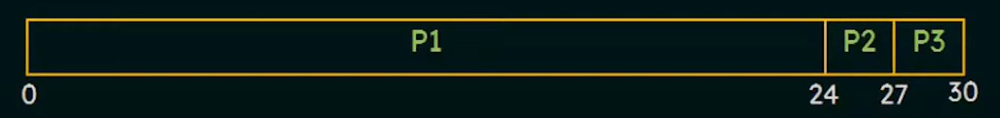

# Scheduling Algorithms

## FCFS (First Come First Serve)
* **Simplest scheduling algorithm**
* **The process that requests the CPU 1st is allocated the CPU 1st**
* **Implementation can be done using a FIFO Queue** 

* **When a process enters the `ready queue` its PCB(Process Control Block) is attached to the back of the tail of the queue**
* **When the CPU is free it is allocated to the Head / First element in the `ready queue`.**
* **In reality as soon as a process gets access to the CPU in FCFS mode, it is removed from the `ready queue`.**

### Drawbacks
1. **The waiting time in FCFS processes can be quite long.**

-----------------------------------------------------------
\
**Consider all of these processes have arrival time T = 0**
|   Process     |   Burst Time      |
|:-------------:|:-----------------:|
|P1             |24                 |
|P2             |3                  |
|P3             |3                  |

-----------------------------------------------------------

**Gantt Chart** 

**Waiting time for P1 = 0**     
**Waiting time for P2 = 24**    
**Waiting time for P3 = 24 + 3 = 27**   

**FCFS is a non preemptive process** \
Basically means that when a process is executing in the CPU only that process will execute untill it is complete and the CPU won't be accessible by any other process until the previous process is completed.

-----------------------------------------------------------

