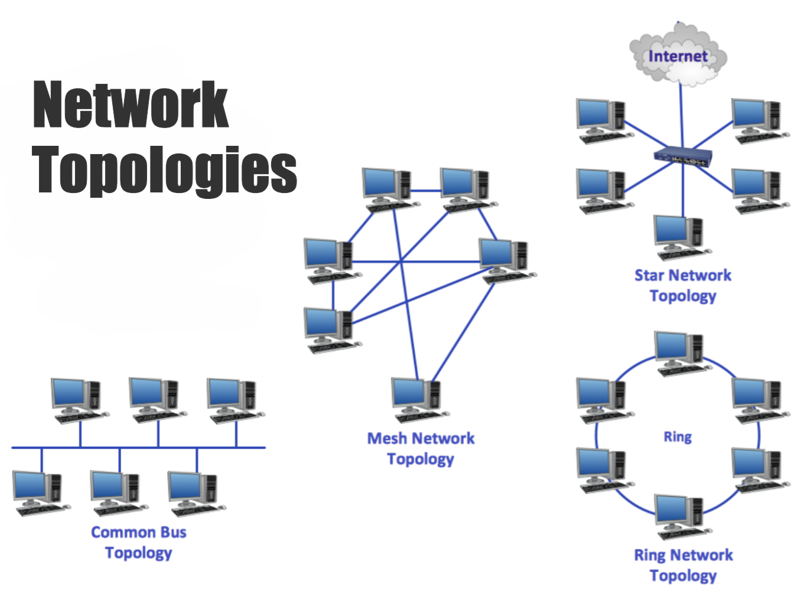
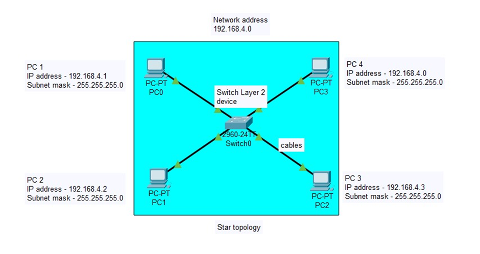
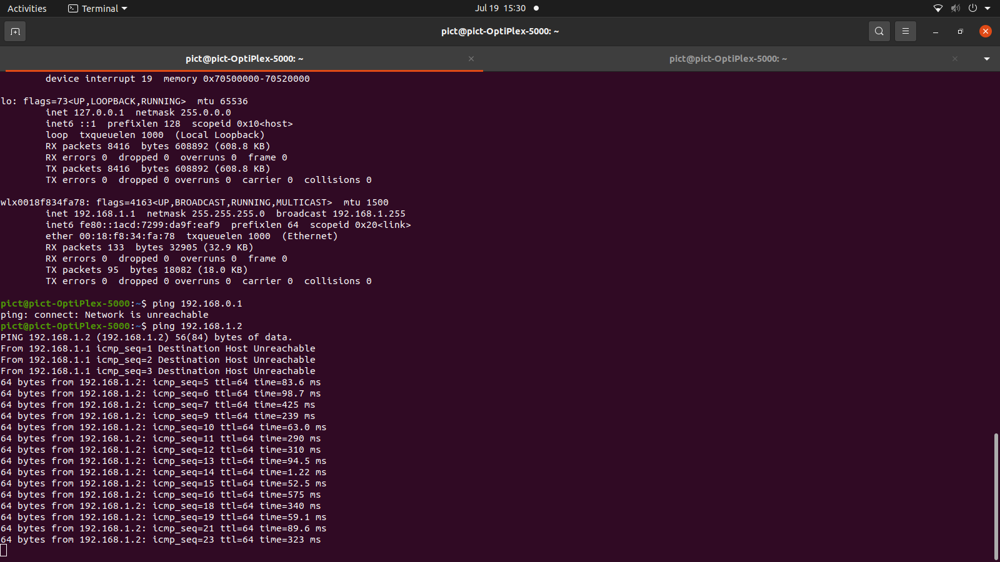
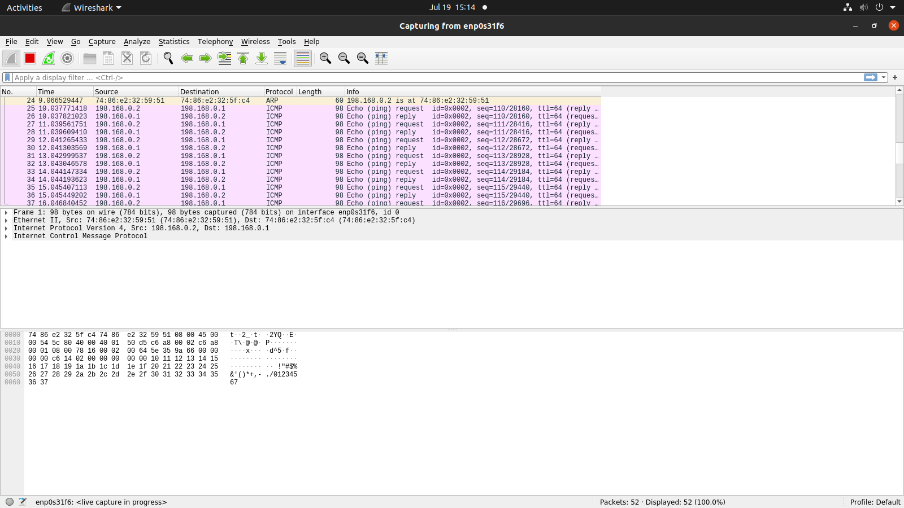

# CNS Assignment No. 1

| Basic Network Configuration                                                                                               | <!--  -->                          |
|:--------------------------------------------------------------------------------------------------------------------------|------------------------------------|
| **Instructor's Name: Prof. B.P. Masram**                                                                                  | **Student's Name: Ayush Chanekar** |
| **Objectives: To learn and understand configuring IP Addresses and related network devices as well as setting up a LAN.** |                                    |

## Problem Statement:

Setup a wired LAN using Layer 2 Switch. It includes preparation of cable, testing of cable using line tester, configuration machine using IP addresses, testing using PING utility & demonstrating the PING packets captured traces using Wireshark Packet Analyzer Tool.

## Equipment & Software:

- Cat 3, Cat 5, Cat 5e Cat 6a Cables and RJ45 Connectors
- Crimping Tool
- Line Tester
- One server Node with Open Source and Internet Support
- HTTP Server (Apache) with Website pages of your Institute
- Four Client Nodes with Wi-Fi Support
- Wireshark Protocol Analyzer on all nodes
- Layer-II Switch
- IP Address Configuration Chart

## Theory/Background

### Computer Networks:

A computer network can be defined as a collection of computing devices (nodes) interconnected by wires or wireless means and governed by a set of standards(protocols) in order to share data and resources.

### Comparison between LAN, MAN, WAN:

| Characteristic         | LAN                        | MAN                                  | WAN                                       |
|------------------------|----------------------------|--------------------------------------|-------------------------------------------|
| Definition             | Local area network         | Metropolitan area network            | Wide area network                         |
| Coverage               | Building/Campus            | City/Large campus                    | Multiple cities/countries                 |
| Design and maintenance | Easy                       | Moderate                             | Difficult                                 |
| Speed                  | High (100 Mbps to 10 Gbps) | Moderate to High (10 Mbps to 1 Gbps) | Variable (1 Mbps to several hundred Mbps) |
| Propagation delay      | Short                      | Moderate                             | Long                                      |
| Technology             | Ethernet, Wi-Fi            | Ethernet, FDDI, ATM                  | MPLS, Frame Relay, ATM, VSAT              |
| Cost                   | Low                        | Moderate                             | High                                      |
| Use Cases              | Offices, Schools           | Government, Universities             | Internet, Corporate Networks              |
| Security               | Easier to secure           | Moderately challenging               | Most challenging                          |
| Fault tolerant         | More tolerant              | Less tolerant                        | Less tolerant                             |
| Congestion             | Less                       | More                                 | More                                      |

### OSI & TCP/IP Layers:

| Layer No. | OSI Model Layers | TCP/IP Model Stages | Devices                 | Protocols                            | Services                                                 |
|-----------|------------------|---------------------|-------------------------|--------------------------------------|----------------------------------------------------------|
| 1         | Physical         | Network Access      | Hubs, Repeaters, Cables | Ethernet, USB                        | Bit transmission                                         |
| 2         | Data Link        | Network Access      | Switches, Bridges       | Ethernet, PPP, Frame Relay, MAC, ARP | Data framing, MAC addressing, Error detection            |
| 3         | Network          | Internet            | Routers                 | IP (IPv4, IPv6), ICMP, IPSec, ARP    | Logical addressing, Routing                              |
| 4         | Transport        | Transport           | -                       | TCP, UDP                             | End-to-end communication, Flow control, Error correction |
| 5         | Session          | Application         | -                       | NetBIOS, PPTP, RPC Session management, Authentication |
| 6         | Presentation     | Application         | -                       | SSL/TLS, FTP, JPEG, MPEG, GIF                         | Data translation, Encryption/Decryption                  |
| 7         | Application      | Application         | -                       | HTTP, HTTPS, FTP, SMTP, DNS, Telnet, POP3, IMAP, SNMP | Network services to end-users                            |

### Switch vs Router vs Bridge vs Hub

| Device            | Switch                                                              | Router                                                                     | Bridge                                                                      | Hub                                                              |
|-------------------|---------------------------------------------------------------------|----------------------------------------------------------------------------|-----------------------------------------------------------------------------|------------------------------------------------------------------|
| Layer             | Data Link (Layer 2)                                                 | Network (Layer 3)                                                          | Data Link (Layer 2)                                                         | Physical (layer 1)                                               |
| Function          | Connects devices within a LAN, forwards data based on MAC addresses | Connects multiple networks, routes data between them based on IP addresses | Connects 2 or more network segments, filters traffic based on MAC addresses | Connects multiple Ethernet devices, broadcasts data to all ports |
| Addressing        | MAC addresses                                                       | IP addresses                                                               | MAC addresses                                                               | None                                                             |
| Traffic isolation | Yes                                                                 | Yes                                                                        | Yes                                                                         | No                                                               |
| Plug and play     | Yes                                                                 | No                                                                         | Yes                                                                         | Yes                                                              |
| Optimal routing   | No                                                                  | Yes                                                                        | No                                                                          | No                                                               |
| Cut through       | Yes                                                                 | No                                                                         | No                                                                          | Yes                                                              |

### Popular Sniffing Tools

- BetterCAP
- Ettercap
- Wireshark
- Tcpdump
- WinDump
- OmniPeek
- Dsniff
- EtherApe
- MSN Sniffer
- NetWitness
- NextGen

### Features of Wireshark

- Available for UNIX & Windows
- Capture live packet data from network interface
- Display packets with very detailed protocol information
- Open & Save packet data captured
- Import & Export packet data from & to a lot of other capture programs
- Filter packets, search for packets on many criteria
- Colorize packet display based on filters
- Create various statistics

## Network Topology
1. **Mesh Topology :** In a mesh topology, every device is connected to another device via a particular channel.Communication is very fast between the nodes, it is very robust and security and privacy is provided as well. However, Installation, configuration and the cost of maintenance is high for this topology.
    - Every device is connected to every other device.
    - Very fast, reliable, and secure communication.   
    - High installation, configuration, and maintenance costs.   
    - Ideal for critical systems like military, government, and power grids.

2. **Star Topology :** In Star Topology, all the devices are connected to a single hub through a cable, the Hub is the central node and can be passive. Star topology is cost effective but the performance is based on the quality of the Hub.
    - All devices connect to a central hub or switch.
    - Easy to set up and manage.
    -  If one device fails, the rest of the network is unaffected.
    - Dependent on the central hub for performance.
    - Commonly used in homes, offices, and small networks.

3. **Bus Topology :** Bus Topology is a network type in which every computer and network device is connected to a single cable. It is bi-directional. It is a multi-point connection and a non-robust topology because if the backbone fails the topology crashes.
    - All devices are connected to a single cable.
    - Simple and cheap to set up.
    - Vulnerable to network failures if the main cable breaks.
    - Can experience performance issues due to data collisions.
    - Best suited for small, basic networks.

4. **Ring Topology :** A ring topology is a network architecture in which devices are connected in a ring structure and send information to each other based on their ring node's neighbouring node. Compared to the bus topology, a ring topology is highly efficient and can handle heavier loads. As packets may only travel in one direction it is also called `uni-directional ring network`.
    - Devices are connected in a circular pattern.
    - Data travels from device to device around the ring.
    - Offers better performance than bus topology.
    - More complex to set up and manage.
    - Vulnerable to failures if any device or connection breaks.

### Commands used:

1. `ifconfig` command
   The ifconfig (interface configuration) command is used to configure, manage, and query network interface parameters in Unix-based systems, including Linux. It's a powerful tool for network management, allowing users to view and change the configuration of network interfaces.\
   This command displays all active network interfaces and their configurations, such as IP addresses, netmask, and broadcast addresses.
2. `sudo wireshark` Command
   wireshark is a powerful network protocol analyser that allows users to capture and interactively browse the traffic running on a computer network. \
   Running it with sudo (superuser do) grants the necessary permissions to capture packets on network interfaces.

### Types of Connectors:

- **RJ45 (Registered Jack 45):** An eight-pin connector commonly used for Ethernet networking.
- **RJ11 (Registered Jack 11):** A four or six-pin connector commonly used for telephone connections.
- **RJ14 (Registered Jack 14):** A six-pin connector similar to RJ11 but used for two telephone lines.
- **RJ21 (Registered Jack 21):** A 50-pin connector often referred to as a "telco" connector.
- **BNC (Bayonet Neill–Concelman):** A quick connect/disconnect RF connector.
- **USB (Universal Serial Bus):** A standard connector for peripheral devices.
- **HDMI (High-Definition Multimedia Interface):** A connector for transmitting audio and video signals.
- **Thunderbolt:** A high-speed interface developed by Intel and Apple.

### PING command (Packet Internet Groper):

The ping command is a network utility used to test the reachability of a host on an Internet Protocol (IP) network. \
It is also used to measure the round-trip time for messages sent from the originating host to a destination computer.\
`ping` uses the ICMP protocol’s mandatory ECHO_REQUEST datagram to elicit an ICMP ECHO_RESPONSE from a host or gateway.\
ECHO_REQUEST datagrams (`‘’ping’’`) have an IP and ICMP header, followed by a `struct timeval` and then an arbitrary number of `“pad”` bytes used to fill out the packet.

- `-c` count: Send count number of packets and then stop.
- `-i` interval: Wait interval seconds between sending each packet. The default is one second.
- `-s` packetsize: Specify the number of data bytes to be sent.
  The default is 56, which translates into 64 ICMP data bytes when combined with the 8 bytes of ICMP header data.
- `-t` ttl: Set the Time To Live (TTL) value for the packets.
- `-W` timeout: Time to wait for a response, in seconds.

### Troubleshooting:

When a ping is made from machine A to machine B which are connected through a switch through the wireshark sniffing tool and

- **Case 1:** The IP of machine B isn’t correctly mentioned while pinging through A then the wireshark on machine A shows ‘Destination Host Unreachable’ error message.
- **Case 2:** The wireshark on machine B is closed during the process then the wireshark on machine A shows ‘Destination Host Unreachable’ error message.
- **Case 3:** The machine B is shut down in between the process then the wireshark on machine A shows ‘Destination Host Unreachable’ error message.
- **Case 4:** The class of IPs of the machines aren’t same then the wireshark on machine A shows ‘Network Unreachable’ error message.

### Graphic Symbols in Cisco Packet Tracer:

1. Bridge
2. Switch
3. Router
4. Access switch
5. Personal computer
6. Web server
7. VLAN
8. Ethernet
9. Serial line
10. Hub

## LAN Topology Used

## PINGING the other device

## Wireshark Connection

### Procedure

1. **Cable Preparation:**
   - Cut Cat 5e cables to length, strip outer jackets, arrange wires, and crimp RJ45 connectors onto ends.
   
2. **Cable Testing:**
   - Test cables with a line tester to ensure proper wiring and connectivity.
   
3. **IP Address Configuration:**
   - Assign unique IP addresses to devices, configure settings, and verify using `ifconfig` or `ipconfig`.

4. **LAN Setup:**
   - Connect devices to the Layer 2 switch with prepared cables, ensure switch ports are active, and verify connections.

5. **Testing Connectivity with PING Utility:**
   - Use the `ping` command to test device connectivity and observe results for successful communication.

6. **Packet Analysis with Wireshark:**
   - Install and start Wireshark on devices, capture packets during ping tests, and analyze ICMP messages.

7. **Troubleshooting:**
   - Simulate network issues (incorrect IPs, closed Wireshark, device shutdown), capture traffic with Wireshark, and resolve issues based on analysis.

---

## Observations and Outcomes

### Observations:

1. **Cable Preparation and Testing:**
   - **Preparation:** Wires were arranged and crimped correctly. 
   - **Testing:** All cables passed connectivity tests.

2. **IP Address Configuration:**
   - Devices were assigned unique IPs within the same subnet and verified with `ifconfig`.

3. **LAN Setup:**
   - Devices connected to the switch were active and verified for proper configuration.

4. **Testing Connectivity:**
   - Devices pinged each other successfully with low RTT.

5. **Wireshark Packet Analysis:**
   - Captured packets showed successful ICMP Echo Request/Reply messages with no packet loss.

6. **Troubleshooting:**
   - Wireshark captured and identified errors (e.g., "Destination Host Unreachable," "Network Unreachable") accurately.

---

### Outcomes:

1. **Successful LAN Setup:**
   - Demonstrated understanding of network configuration and device connectivity.

2. **Effective Cable Management:**
   - Proper cable preparation ensured reliable connections.

3. **IP Address Configuration Proficiency:**
   - Reinforced correct IP address assignment to avoid conflicts.

4. **Network Testing and Verification:**
   - PING utility validated network connectivity and performance.

5. **Proficiency in Packet Analysis:**
   - Hands-on Wireshark use enhanced understanding of network protocols and troubleshooting.

6. **Troubleshooting Skills:**
   - Developed ability to diagnose and resolve network issues using Wireshark.

## Analysis

### Interpretation of the Results

- **Network Setup and Connectivity:**
  - The LAN setup was successful, with devices connecting through the Layer 2 switch and passing PING tests, indicating proper communication.

- **Packet Analysis:**
  - Wireshark captured ICMP Echo Request and Reply packets as expected, with no packet loss or delays, showing that the network functioned correctly.

### Comparison with Expected Results

- **Expected Results:**
  - Devices should communicate through the switch, pings should succeed with low latency, and Wireshark should capture ICMP packets without issues.

- **Observed Results:**
  - Results aligned with expectations: successful communication, pings, and packet capture.

### Analysis

#### Interpretation of the Results

- **Network Setup and Connectivity:**
  - The LAN setup was successful, with devices connecting through the Layer 2 switch and passing PING tests, indicating proper communication.

- **Packet Analysis:**
  - Wireshark captured ICMP Echo Request and Reply packets as expected, with no packet loss or delays, showing that the network functioned correctly.

#### Comparison with Expected Results

- **Expected Results:**
  - Devices should communicate through the switch, pings should succeed with low latency, and Wireshark should capture ICMP packets without issues.

- **Observed Results:**
  - Results aligned with expectations: successful communication, pings, and packet capture.

#### Possible Reasons for Any Discrepancies

- **Incorrect IP Configuration:**
  - Incorrect IPs or subnets would cause ping failures and errors in Wireshark.

- **Cable Issues:**
  - Faulty or improperly crimped cables could result in connectivity issues or packet loss.

- **Device Malfunctions:**
  - Issues with the switch or devices could cause network problems or incomplete packet captures.

- **Wireshark Configuration:**
  - Incorrect Wireshark settings could lead to missing packets or capture errors.

---

### References

1. **Cisco Networking Academy.** "Introduction to Networks." Cisco Systems, 2023.
2. [**Computer Networking Topology and its Types** "Javatpoint.com"](https://www.javatpoint.com/computer-network-topologies)
3. **Forouzan, Behrouz A.** "Data Communications and Networking." McGraw-Hill Education, 2021.
4. **Wireshark Documentation.** "User's Guide." Wireshark Foundation, 2024. [Wireshark Documentation](https://www.wireshark.org/docs/wsug_html_chunked/)
5. **TechTarget.** "Network Troubleshooting Tips and Tools." TechTarget, 2024. [TechTarget Network Troubleshooting](https://www.techtarget.com/searchnetworking/definition/network-troubleshooting)

### Conclusion
The experiment demonstrated the basic setup and configuration of a network. The objectives were met as the devices communicated successfully.
