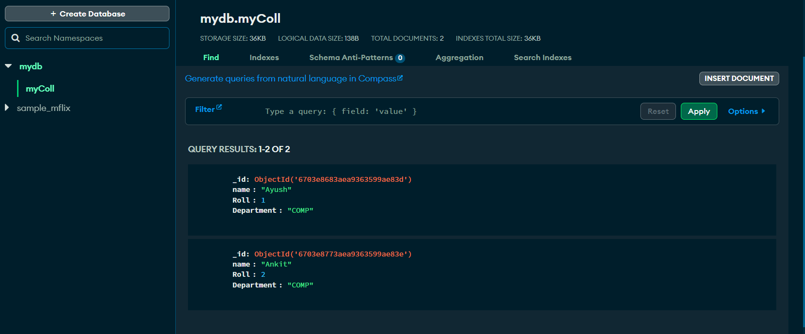

# Assignment 12 
## Roll no. `31311`

## MongoDB Connectivity by JAVA 

## Performed CRUD OPERATIONS


```shell
PS D:\Coding-practice\PICT_Practicals\Pict-Practicals\assignment12>  d:; cd 'd:\Coding-practice\PICT_Practicals\Pict-Practicals\assignment12'; & 'C:\Program Files\Java\jdk-22\bin\java.exe' '@C:\Users\chane\AppData\Local\Temp\cp_cz4pymrtwza0p9kf0w7tkfs28.argfile' 'App' 
Welcome to K-III DB
Please wait while we are connecting to MongoDBSLF4J: No SLF4J providers were found.
SLF4J: Defaulting to no-operation (NOP) logger implementation
SLF4J: See https://www.slf4j.org/codes.html#noProviders for further details.

Menu:
1. Create User
2. Find User
3. Update User
4. Delete User
5. Show All Users
6. Exit
Enter your choice: 1
Enter name: Ayush
Enter Roll: 1
Enter Department: COMP
User created: {"name": "Ayush", "Roll": 1, "Department": "COMP", "_id": {"$oid": "6703e8683aea9363599ae83d"}}

Menu:
1. Create User
2. Find User
3. Update User
4. Delete User
5. Show All Users
6. Exit
Enter your choice: 1
Enter name: Ankit
Enter Roll: 2
Enter Department: COMP
User created: {"name": "Ankit", "Roll": 2, "Department": "COMP", "_id": {"$oid": "6703e8773aea9363599ae83e"}}

Menu:
1. Create User
2. Find User
3. Update User
4. Delete User
5. Show All Users
6. Exit
Enter your choice: 1
Enter name: Pundalik
Enter Roll: 21
Enter Department: ENTC
User created: {"name": "Pundalik", "Roll": 21, "Department": "ENTC", "_id": {"$oid": "6703e88a3aea9363599ae83f"}}

Menu:
1. Create User
2. Find User
3. Update User
4. Delete User
5. Show All Users
6. Exit
Enter your choice: 5
Users in the database:
{"_id": {"$oid": "6703e8683aea9363599ae83d"}, "name": "Ayush", "Roll": 1, "Department": "COMP"}
{"_id": {"$oid": "6703e8773aea9363599ae83e"}, "name": "Ankit", "Roll": 2, "Department": "COMP"}
{"_id": {"$oid": "6703e88a3aea9363599ae83f"}, "name": "Pundalik", "Roll": 21, "Department": "ENTC"}

Menu:
1. Create User
2. Find User
3. Update User
4. Delete User
5. Show All Users
6. Exit
Enter your choice: 3
Enter name of the user to update: Pundalik
Available fields to update: 
1. Name
2. Roll
3. Department
Choose a field to update (1-3): 3
Enter new Department: IT
User Department updated.
Updated User: {"_id": {"$oid": "6703e88a3aea9363599ae83f"}, "name": "Pundalik", "Roll": 21, "Department": "IT"}

Menu:
1. Create User
2. Find User
3. Update User
4. Delete User
5. Show All Users
6. Exit
Enter your choice: 5
Users in the database:
{"_id": {"$oid": "6703e8683aea9363599ae83d"}, "name": "Ayush", "Roll": 1, "Department": "COMP"}
{"_id": {"$oid": "6703e8773aea9363599ae83e"}, "name": "Ankit", "Roll": 2, "Department": "COMP"}
{"_id": {"$oid": "6703e88a3aea9363599ae83f"}, "name": "Pundalik", "Roll": 21, "Department": "IT"}

Menu:
1. Create User
2. Find User
3. Update User
4. Delete User
5. Show All Users
6. Exit
Enter your choice: 2
Enter name to find: Ayush
User found: {"_id": {"$oid": "6703e8683aea9363599ae83d"}, "name": "Ayush", "Roll": 1, "Department": "COMP"}

Menu:
1. Create User
2. Find User
3. Update User
4. Delete User
5. Show All Users
6. Exit
Enter your choice: 5
Users in the database:
{"_id": {"$oid": "6703e8683aea9363599ae83d"}, "name": "Ayush", "Roll": 1, "Department": "COMP"}
{"_id": {"$oid": "6703e8773aea9363599ae83e"}, "name": "Ankit", "Roll": 2, "Department": "COMP"}
{"_id": {"$oid": "6703e88a3aea9363599ae83f"}, "name": "Pundalik", "Roll": 21, "Department": "IT"}

Menu:
1. Create User
2. Find User
3. Update User
4. Delete User
5. Show All Users
6. Exit
Enter your choice: 4
Enter name of the user to delete: Pundalik
User deleted.
User not found after deletion.

Menu:
1. Create User
2. Find User
3. Update User
4. Delete User
5. Show All Users
6. Exit
Enter your choice: 5
Users in the database:
{"_id": {"$oid": "6703e8683aea9363599ae83d"}, "name": "Ayush", "Roll": 1, "Department": "COMP"}
{"_id": {"$oid": "6703e8773aea9363599ae83e"}, "name": "Ankit", "Roll": 2, "Department": "COMP"}

Menu:
1. Create User
2. Find User
3. Update User
4. Delete User
5. Show All Users
6. Exit
Enter your choice: 6
Exiting the program.
PS D:\Coding-practice\PICT_Practicals\Pict-Practicals\assignment12>
```

