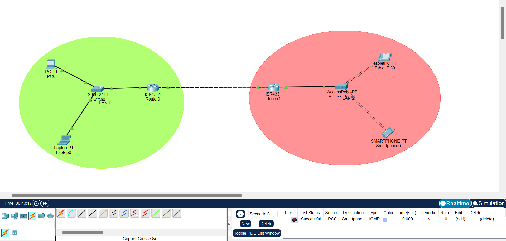

# CNS Assignment No. 2

| WAN Network Configuration                                                                                                                       | <!--  -->                          |
|:------------------------------------------------------------------------------------------------------------------------------------------------|------------------------------------|
| **Instructor's Name: Prof. B.P. Masram**                                                                                                        | **Student's Name: Ayush Chanekar** |
| **Objectives: To learn and understand configuring IP Addresses and related network devices and  access points as well as setting up a WAN.** |                                    |

## Problem Statement:

Setup a WAN which contains wired as well as wireless LAN by using `packet tracer tool`. 
Demonstrate transfer of a packet from LAN 1 (wired LAN) to LAN2 Wireless LAN.

