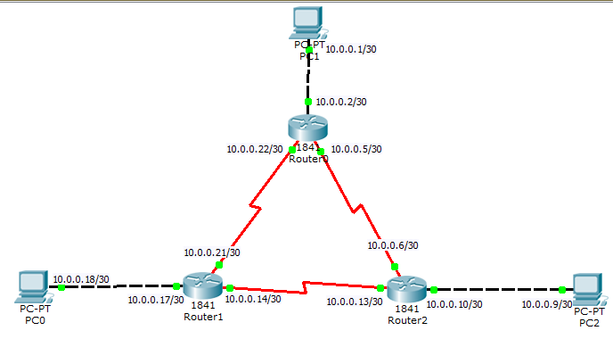

# Assignment 7
## Use packet Tracer tool for configuration of 3 router network using one of the following protocol RIP/OSPF/BGP.
## OSPF
OSPF (Open Shortest Path First) is a link-state routing protocol used in Internet Protocol (IP) networks to determine the best path for data to travel between devices. It is widely used in large enterprise networks due to its scalability and fast convergence properties.

- **Link-State Protocol:** OSPF builds a complete map (or topology) of the network and uses the Dijkstra algorithm to calculate the shortest path to each destination.

- **Hierarchical Design:** OSPF uses a multi-area design, which helps in reducing routing overhead. The network is divided into areas:

- **Fast Convergence:** OSPF quickly updates routing tables in the event of a network change, helping to minimize downtime.

- **Cost-based Routing:** OSPF uses a cost metric (typically based on bandwidth) to determine the best path, with lower cost links being preferred.

### How does it work?

1. Each router using OSPF shares its link-state advertisements (LSAs) with all other routers in the network.
2. These LSAs contain information about the router's neighbors and the network topology.
3. Routers use this information to construct a link-state database (LSDB) and independently compute the shortest path to each network destination.

| Feature                     | OSPF (Open Shortest Path First)                        | BGP (Border Gateway Protocol)                                        | RIP (Routing Information Protocol)                           |
|-----------------------------|--------------------------------------------------------|----------------------------------------------------------------------|--------------------------------------------------------------|
| **Type of Protocol**        | Link-State                                             | Path-Vector                                                          | Distance-Vector                                              |
| **Algorithm**               | Dijkstra’s Algorithm (Shortest Path First)             | Best Path Selection (based on attributes like AS path, policy, etc.) | Bellman-Ford Algorithm                                       |
| **Administrative Distance** | 110                                                    | 20 (External BGP), 200 (Internal BGP)                                | 120                                                          |
| **Metric**                  | Cost (based on link bandwidth)                         | Path attributes (AS Path, Next Hop, etc.)                            | Hop count (max of 15 hops)                                   |
| **Convergence Time**        | Fast (link-state updates sent only when changes occur) | Slow (due to large network sizes and path computation)               | Slow (periodic updates every 30 seconds)                     |
| **Use Case**                | Intra-domain (used within a single autonomous system)  | Inter-domain (used between autonomous systems on the internet)       | Small networks, not scalable for large networks              |
| **Scalability**             | Highly scalable                                        | Extremely scalable                                                   | Poor scalability                                             |
| **Hop Limit**               | No hop limit                                           | No hop limit                                                         | 15 hop limit                                                 |
| **Routing Updates**         | Triggered updates                                      | Triggered updates (incremental)                                      | Periodic updates (every 30 seconds)                          |
| **Authentication**          | Supports authentication (plaintext or MD5)             | Supports authentication                                              | Supports authentication                                      |
| **Routing Table Size**      | Moderate (due to link-state databases)                 | Very large (internet-wide routing)                                   | Small (limited by hop count)                                 |
| **Classful/Classless**      | Classless (supports VLSM)                              | Classless (supports VLSM)                                            | Originally classful, now classless (supports VLSM in RIP v2) |
| **Administrative Domain**   | Interior Gateway Protocol (IGP)                        | Exterior Gateway Protocol (EGP)                                      | Interior Gateway Protocol (IGP)                              |
